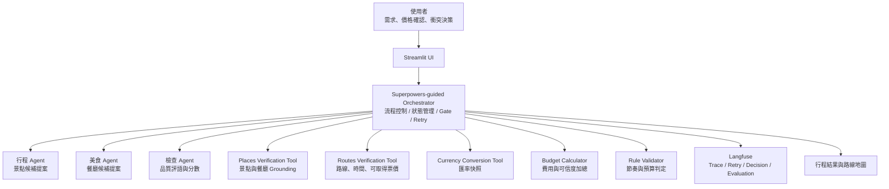
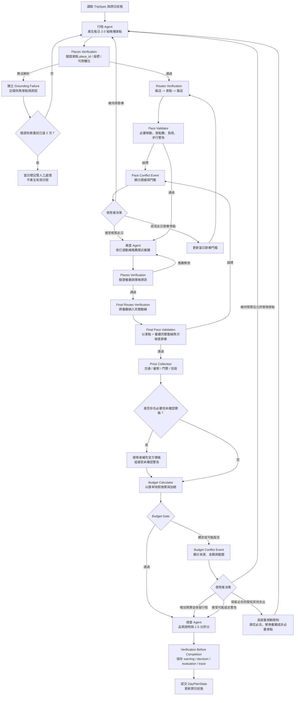

# Multi-Agent Travel Planner: Superpowers-Guided Verification Workflow Design

## 1. 文件目的

本文件定義「Multi-Agent Travel Planner：多代理人旅遊規劃助手」的新版系統設計。系統以原有五個專業 Agent 為使用者可理解的業務角色，將 Superpowers 的結構化工作流程導入實際執行控制，使旅遊計畫不只是由 LLM 生成文字，而是經過真實資料驗證、使用者決策與完成前審查後才成立。

本設計聚焦於可展示的 MVP：

- 使用者規劃以日本大阪為主要目的地的 1 至 5 日旅遊。
- 系統使用真實外部 API，不以預先固定的行程資料替代 API 結果。
- 系統可在 Demo 中展示兩種 human-in-the-loop 衝突處理：
  - 行程節奏過趕。
  - 預算確定或可能超支。
- 系統保存資料來源、價格狀態、匯率快照、驗證結果與使用者決策紀錄。

## 2. 核心定位

本系統為一個由 `Superpowers-guided Orchestrator` 控制的多 Agent 旅遊規劃流程：

1. 先透過互動確認需求與限制，建立不可被 Agent 任意更改的 `TripSpec`。
2. 以單日為原子規劃單位，逐日產生候補、驗證動線與計算預算。
3. 讓 LLM Agent 負責提案、推薦與說明；讓 API 與確定性程式負責事實、數值與規則判定。
4. 當驗證遇到節奏或預算衝突時，暫停流程讓使用者選擇接受、調整限制或重新規劃。
5. 只有通過所有必要驗證、或具備使用者明確接受警告的日程，才能寫入跨日狀態並產生最終輸出。

Superpowers 在本作品中不是第六個 Agent，也不是宣稱 CrewAI 會原生執行的外掛能力。它是工作流程設計原則與控制層規範，實際表現在需求確認、任務原子化、Skill 規格、工具驗證、結構化回退、人機決策與完成前查核。

## 3. 範圍與限制

### 3.1 MVP 支援範圍

| 項目 | 支援範圍 |
| --- | --- |
| 目的地 | 以大阪市區與鄰近可由公共交通到達地點為 Demo 主體 |
| 天數 | 1 至 5 日 |
| 住宿 | 使用者先提供住宿地點；每日從住宿出發並納入返回住宿路段 |
| 交通 | 大眾運輸與步行 |
| 行程節奏 | 非常悠閒、悠閒、一般、密集四種模式 |
| 預算 | 支援不同原始幣別，統一換算為使用者選定預算幣別 |
| 費用來源 | API 回傳價格、API 價格範圍、使用者依官方來源確認的價格 |
| 外部驗證 | 地點、餐廳、路線、可取得票價與匯率 |
| 使用者決策 Gate | 節奏過趕、預算超支或價格資訊不足 |
| 觀測 | Langfuse trace、工具結果、重試、決策與評分 |

### 3.2 明確不承諾事項

- 不由 LLM 虛構精確票價、餐費、住宿費或匯率。
- 不宣稱換算金額等同最終刷卡結算或現金換匯成本。
- 不保證 Google Routes 對所有公共交通路線回傳票價。
- 不在 MVP 中建立完整 OTA 住宿即時比價或機票查價服務。
- 不在真實 API 發生失敗時偷偷改用固定行程資料而仍宣稱已驗證。

## 4. 系統架構



### 4.1 五個業務 Agent 與內部責任

| 業務角色 | 對使用者呈現的功能 | 實作責任與界線 |
| --- | --- | --- |
| 行程 Agent | 依需求規劃當日景點 | LLM 產生 2 至 3 組候補；不得捏造 API 驗證結果或費用 |
| 交通 Agent | 驗證交通合理性並選擇路線 | 由 Places / Routes 工具與確定性排序規則完成核心判斷；LLM 僅可解釋 |
| 預算 Agent | 說明支出與預算狀態 | `Budget Calculator` 負責數值計算；LLM 僅可解釋超支原因與調整方向 |
| 美食 Agent | 推薦符合偏好及區域的餐廳 | LLM 產生候補；餐廳存在性、位置與價格欄位仍由工具驗證 |
| 檢查 Agent | 呈現最終品質評語 | 讀取 Validator 結果給 1 至 5 分與說明；不得推翻工具或使用者決策 |

### 4.2 Superpowers 原則落地

| 原則 | 系統行為 |
| --- | --- |
| Brainstorming | 排程前詢問目的地、預算、節奏、住宿、必去景點、已知價格與預算包含範圍 |
| Atomization | 以每日為最小完成單位，日程完成後才規劃下一日 |
| Skill Library | 每個 LLM Agent 具備固定輸入、輸出格式、工具邊界與禁止事項 |
| Tool Verification | 地點、路線、票價可得性及匯率均由真實 API 或使用者確認來源驗證 |
| Structured Feedback | 每次失敗建立可追蹤的 `ConflictEvent` 或 `FailureEvent`，回傳具體限制 |
| Human-in-the-loop | 節奏與預算衝突交由使用者決定取捨，而非 Agent 自行猜測 |
| Verification Before Completion | 驗證與必要決策處理完畢後才提交每日狀態 |
| Evaluation / Observability | Langfuse 保存 trace、成本、重試、來源、決策及品質評分 |

## 5. 資料來源與 API 選型

### 5.1 API 與資料來源矩陣

| 資料用途 | 提供者 | 取得方式 | 選用原因與限制 |
| --- | --- | --- | --- |
| 景點、餐廳正式識別與座標 | Google Places API (New) | API | 使用 `place_id` 與座標進行 Grounding；可取得部分營業或價位欄位 |
| 完整動線、交通時間與路線 | Google Routes API | API | 新版 Google Maps 路線服務；用於必要移動時間及顯示路線 |
| 公共交通票價 | Google Routes API `transitFare` | API 回傳時使用 | 與路線來自相同來源，但非所有 transit route 都有票價 |
| 餐廳價格 | Google Places API (New) `priceLevel` / `priceRange` | API | 作為級距或範圍，不當作實際結帳精確金額 |
| 景點門票 | 景點官方售票頁面 | 使用者輸入價格並附來源網址 | Places 不保證提供門票金額，官方售票資料較可追溯 |
| 住宿費 | 官方訂房頁面或使用者預訂證明 | 使用者輸入價格並附來源網址 | MVP 不新增 OTA 供應商整合與合約負擔 |
| JPY/TWD 換算 | ExchangeRate-API | API | 支援所需幣別及回傳時間資訊，適合作為預算估算匯率快照 |
| Agent 文字推理 | Azure OpenAI | API | 提供生成、解釋與摘要能力；不作為事實資料來源 |
| 執行追蹤 | Langfuse | SDK / API | 保存 Agent 與 tool traces、衝突、決策、費用與評分 |

### 5.2 API 選擇修正

原始 v3 文件中的舊版 `Distance Matrix API` 應更新為 `Google Routes API`，且 Places 應明確採用 `Places API (New)`。LM Studio 不列為 Azure OpenAI 的正式呼叫中介；主要 LLM 路徑為 CrewAI / Orchestrator 直接連接 Azure OpenAI，LM Studio 如保留僅定位為另外的本地模型實驗選項。

### 5.3 價格可信度等級

| 狀態 | 意義 | 預算 Gate 使用方式 |
| --- | --- | --- |
| `API_VERIFIED_EXACT` | API 回傳精確數值，例如可取得的 transit fare | 計入確定費用 |
| `USER_CONFIRMED_OFFICIAL_SOURCE` | 使用者根據官方頁面或訂單提供精確數值與來源 | 計入確定費用 |
| `API_VERIFIED_RANGE` | API 提供價格範圍或級距 | 計入最低與最高估算 |
| `MISSING_PRICE` | 尚無可驗證數值 | 不可假裝確定，進入補價或接受警告決策 |

### 5.4 匯率及換算原則

- 每趟旅程建立一次 `ExchangeRateSnapshot`，整趟行程使用同一版本的匯率。
- 保存原始價格與原始幣別，例如 `JPY 8,600`，再換算至使用者預算幣別，例如 `TWD`。
- 若使用者要求更新匯率，必須建立新快照並重新計算全部費用，不混用匯率版本。
- 換算結果標示為預算估算值，不等同銀行換匯或信用卡最終請款。

### 5.5 API 來源註冊表與維護邊界

實作時，外部 API 與資料來源說明必須獨立集中於一個註冊表模組，不得將 provider 名稱、用途、來源可信度或顯示說明分散硬編碼於 Agent、頁面或驗證流程中。初步檔案責任定義如下：

```text
app/
  integrations/
    api_registry.py
```

`api_registry.py` 應負責：

- 列出系統使用的外部服務，例如 Google Places API (New)、Google Routes API、ExchangeRate-API、Azure OpenAI 與 Langfuse。
- 保存每個服務的用途、文件網址、回傳資料可信度及 UI 顯示用限制說明。
- 定義統一的 provider key，例如 `GOOGLE_PLACES_NEW`、`GOOGLE_ROUTES`、`EXCHANGE_RATE_API`。
- 提供 workflow 與結果畫面查詢來源 metadata 的單一介面。
- 支援日後替換匯率或路線提供者時，只需修改整合層與註冊表，而非修改 Agent prompt 與多個 UI 元件。

敏感資訊不存放在註冊表內：

- API key、endpoint secret 與 Azure credential 必須使用環境變數或安全設定來源。
- `api_registry.py` 僅記錄公開 metadata、用途、來源政策與資料可信度。

此外，每次實際呼叫的 request 結果證據仍需記錄在 trace 或 domain record 中，例如 `PriceRecord.source` 與 `ExchangeRateSnapshot.provider`。註冊表描述「服務是什麼與為何使用」，單次資料紀錄描述「這次結果何時由哪個服務取得」，兩者不可混為一份資料。

## 6. 旅遊節奏規則

研究資料不支持將單一交通時間門檻宣稱為所有城市旅客的固定疲勞標準。因此本系統將節奏視為使用者可選產品規則，數值由旅遊時間研究啟發，並在 UI 中允許使用者覆核或接受單日例外。

### 6.1 四級節奏模式

| 模式 | 使用者語意 | 主要景點上限 | 必要移動總時間上限 | 最長單段必要移動 | 步行警告線 |
| --- | --- | ---: | ---: | ---: | ---: |
| 非常悠閒 `VERY_RELAXED` | 慢慢走、幾乎不趕行程 | 1 至 2 個 | 75 分鐘 | 30 分鐘 | 4 km |
| 悠閒 `RELAXED` | 不想太累 | 2 個 | 90 分鐘 | 35 分鐘 | 6 km |
| 一般 `STANDARD` | 一般城市觀光安排 | 3 個 | 120 分鐘 | 50 分鐘 | 10 km |
| 密集 `INTENSIVE` | 想多踩點、接受較累 | 4 個 | 180 分鐘 | 75 分鐘 | 15 km |

使用者輸入「不想太累」時，UI 建議選定 `RELAXED`，亦即必要移動總時間上限為 90 分鐘，而非原 v3 所假設的更嚴格值。

### 6.2 必要移動時間定義

欄位使用 `max_required_transfer_minutes_per_day`，不使用 `max_total_travel_minutes_per_day`，理由是景區內散步可能本身屬於體驗內容。必要移動至少包含：

- 住宿地點至第一個排定停留點。
- 景點與餐廳之間為完成行程所需的轉移路段。
- 最後停留點返回住宿地點。

### 6.3 景點負荷標籤

| 標籤 | 範例 | 驗證行為 |
| --- | --- | --- |
| `FULL_DAY_HIGH_LOAD` | 大型主題樂園 | 當日不再排其他主要景點，餐飲可安排於場內或鄰近 |
| `LONG_VISIT` | 大型水族館、博物館 | 悠閒模式至多搭配一個鄰近主要景點 |
| `FLEXIBLE_VISIT` | 商圈、散步區、美食街 | 可與附近餐廳或小型停留合併 |
| `DAY_TRIP` | 跨城市一日遊 | 使用獨立日程說明並提示較高交通負荷 |

景點負荷標籤可由初始資料規則或使用者確認提供；若僅由 LLM 建議，需在品質說明中標明其為推論而非 API 事實。

## 7. 核心資料模型

### 7.1 `TripSpec`

`TripSpec` 是規劃前確認的主規格。Agent 不得自行更改使用者設定的預算、必去項目或節奏限制。

```json
{
  "trip_id": "trip_osaka_001",
  "destination": {
    "city": "Osaka",
    "country": "Japan"
  },
  "duration": {
    "start_date": "2026-07-06",
    "days": 5,
    "nights": 4
  },
  "budget": {
    "amount": 25000,
    "currency": "TWD",
    "included_categories": ["lodging", "transport", "admission", "meal"],
    "excluded_categories": ["flight", "shopping"],
    "override_history": []
  },
  "pace_preference": {
    "level": "RELAXED",
    "selected_by_user": true,
    "threshold_basis": "PRODUCT_PRESET_INFORMED_BY_TRAVEL_TIME_RESEARCH",
    "max_major_places_per_day": 2,
    "max_required_transfer_minutes_per_day": 90,
    "max_single_transfer_minutes": 35,
    "walking_distance_warning_km": 6,
    "allow_user_override_after_conflict": true
  },
  "preferences": {
    "interests": ["anime", "food"],
    "avoid": ["overpacked_schedule"]
  },
  "lodging": [
    {
      "name": "User Confirmed Osaka Hotel",
      "place_id": "google_place_id",
      "nights": 4,
      "price_record_id": "price_hotel_001"
    }
  ],
  "must_visit_places": [
    {
      "name": "Universal Studios Japan",
      "place_id": "google_place_id",
      "locked": true,
      "load_tag": "FULL_DAY_HIGH_LOAD",
      "price_record_id": "price_usj_001"
    }
  ],
  "exchange_rate_snapshot_id": "fx_jpy_twd_001"
}
```

### 7.2 `PriceRecord`

```json
{
  "price_record_id": "price_usj_001",
  "item_type": "ADMISSION",
  "item_name": "Universal Studios Japan Ticket",
  "amount_original": 8600,
  "currency_original": "JPY",
  "verification_status": "USER_CONFIRMED_OFFICIAL_SOURCE",
  "value_type": "EXACT",
  "source": {
    "provider": "Universal Studios Japan Official Website",
    "url": "https://www.usj.co.jp/web/en/us",
    "retrieved_or_confirmed_at": "2026-05-24T19:30:00+08:00"
  },
  "converted_value": {
    "amount": 1713,
    "currency": "TWD",
    "exchange_rate_snapshot_id": "fx_jpy_twd_001"
  }
}
```

對價格範圍應存為：

```json
{
  "price_record_id": "price_food_002",
  "item_type": "MEAL",
  "item_name": "Verified Restaurant Candidate",
  "currency_original": "JPY",
  "verification_status": "API_VERIFIED_RANGE",
  "value_type": "RANGE",
  "amount_original_min": 1000,
  "amount_original_max": 2000,
  "source": {
    "provider": "Google Places API (New)",
    "field": "priceRange",
    "retrieved_or_confirmed_at": "2026-05-24T19:45:00+08:00"
  }
}
```

### 7.3 `ExchangeRateSnapshot`

```json
{
  "exchange_rate_snapshot_id": "fx_jpy_twd_001",
  "provider": "ExchangeRate-API",
  "base_currency": "JPY",
  "target_currency": "TWD",
  "conversion_rate": 0.19918,
  "rate_type": "INDICATIVE_MIDPOINT",
  "retrieved_at": "2026-05-24T19:31:00+08:00",
  "disclaimer": "Estimated conversion only; actual cash exchange or card settlement may differ."
}
```

### 7.4 `DayPlanState`

```json
{
  "day": 2,
  "status": "VALIDATING",
  "start_place_id": "hotel_place_id",
  "end_place_id": "hotel_place_id",
  "candidate_version": 2,
  "retry_count": 1,
  "selected_places": [
    {
      "name": "Nipponbashi Denden Town",
      "place_id": "google_place_id",
      "locked": false,
      "load_tag": "FLEXIBLE_VISIT"
    },
    {
      "name": "Dotonbori",
      "place_id": "google_place_id",
      "locked": false,
      "load_tag": "FLEXIBLE_VISIT"
    }
  ],
  "selected_meals": [],
  "route_verification": {
    "status": "PASSED",
    "provider": "Google Routes API",
    "total_required_transfer_minutes": 52,
    "max_single_transfer_minutes": 23,
    "retrieved_at": "2026-05-24T19:50:00+08:00"
  },
  "budget_verification": {
    "status": "PENDING"
  },
  "warnings": [],
  "quality_score": null
}
```

### 7.5 `ConflictEvent`

節奏衝突：

```json
{
  "conflict_id": "conflict_day2_pace_001",
  "day": 2,
  "type": "PACE_EXCEEDED",
  "severity": "BLOCKING",
  "observed": {
    "total_required_transfer_minutes": 142,
    "max_single_transfer_minutes": 56
  },
  "expected": {
    "max_required_transfer_minutes": 90,
    "max_single_transfer_minutes": 35
  },
  "evidence": {
    "provider": "Google Routes API",
    "retrieved_at": "2026-05-24T19:50:00+08:00"
  },
  "status": "AWAITING_USER_DECISION"
}
```

預算衝突：

```json
{
  "conflict_id": "conflict_day2_budget_001",
  "day": 2,
  "type": "BUDGET_EXCEEDED",
  "severity": "BLOCKING",
  "observed": {
    "confirmed_total_twd": 27800,
    "budget_limit_twd": 25000,
    "over_by_twd": 2800
  },
  "evidence": {
    "price_record_ids": ["price_hotel_001", "price_usj_001"],
    "exchange_rate_snapshot_id": "fx_jpy_twd_001"
  },
  "status": "AWAITING_USER_DECISION"
}
```

### 7.6 `UserDecision`

使用者接受增加預算且保留目前方案時：

```json
{
  "decision_id": "decision_budget_001",
  "conflict_id": "conflict_day2_budget_001",
  "choice": "INCREASE_BUDGET_KEEP_PLAN",
  "payload": {
    "new_budget_limit_twd": 28000
  },
  "effects": {
    "update_trip_spec_budget": true,
    "requires_replanning": false,
    "requires_final_review": true,
    "warnings_to_preserve": ["USER_APPROVED_BUDGET_INCREASE"]
  }
}
```

使用者保留必去項目但維持原預算時：

```json
{
  "decision_id": "decision_budget_002",
  "conflict_id": "conflict_day2_budget_001",
  "choice": "KEEP_LOCKED_ITEMS_REDUCE_OTHER_COSTS",
  "payload": {
    "locked_place_ids": ["usj_place_id"],
    "max_budget_twd": 25000
  },
  "effects": {
    "requires_replanning": true,
    "replanning_scope": "REPLACE_OPTIONAL_ITEMS_AND_MEALS",
    "constraints": [
      "KEEP_LOCKED_PLACES",
      "REDUCE_CONFIRMED_OR_MAX_ESTIMATED_COST"
    ]
  }
}
```

使用者接受較累的單日行程時：

```json
{
  "decision_id": "decision_pace_001",
  "conflict_id": "conflict_day2_pace_001",
  "choice": "ACCEPT_PACE_WARNING_KEEP_PLAN",
  "effects": {
    "requires_replanning": false,
    "requires_final_review": true,
    "warnings_to_preserve": ["USER_ACCEPTED_INTENSIVE_DAY"]
  }
}
```

## 8. 完整執行流程

### 8.1 規劃前需求確認

Streamlit UI 先取得並確認以下內容：

1. 目的地、日期或天數及人數。
2. 總預算、預算幣別、納入與排除費用類別。
3. 興趣與避免事項。
4. 節奏模式；輸入「不想太累」時提示 `RELAXED` 設定。
5. 飯店位置、住宿已知價格及來源。
6. 必去景點、已知票價及來源。
7. 是否接受規劃中補充官方價格或接受價格不完整警告。

完成確認後才建立 `TripSpec` 與匯率快照，並開始每日規劃。

### 8.2 每日驗證流程



### 8.3 每日提交條件

`DayPlanState.status` 僅可在以下條件成立時更新為 `APPROVED`：

- 景點與已排定餐廳已取得可用 `place_id`。
- 納入餐廳與返回住宿的完整路線已透過 Routes API 驗證，並再次通過節奏 Gate 或取得使用者接受警告。
- 節奏 Gate 通過，或使用者已明確接受該日節奏警告。
- 預算 Gate 通過，或使用者已明確接受預算增加、可能超支或未確認價格警告。
- 檢查 Agent 已完成品質說明與分數。
- 必要 tool 結果、衝突、決策與警告已送交 Langfuse，或已記錄 Langfuse 寫入警告。

### 8.4 跨日狀態

- 每日固定從住宿地點出發。
- 每日動線驗證包含返回住宿地點。
- 下一日仍從有效住宿地點出發，不以前一天最後景點作為次日起點。
- 跨日狀態保存：
  - 已核准日程。
  - 剩餘或更新後的預算資訊。
  - 已訪景點清單。
  - 已接受的警告及使用者覆核。
  - 目前匯率快照 ID。

## 9. 衝突與回退分流

### 9.1 節奏衝突

| 使用者選擇 | 是否重規劃 | 行為 |
| --- | ---: | --- |
| 維持目前節奏 | 是 | 保持原門檻，要求行程 Agent 產生更集中且符合時間限制的候補 |
| 接受此日較累 | 否 | 保留目前方案，建立 `USER_ACCEPTED_INTENSIVE_DAY` 警告並進入後續驗證 |
| 提高此日節奏模式 | 不立即重排 | 將當日門檻更新後，使用現有路線結果重新判定 |

### 9.2 預算衝突

| 使用者選擇 | 是否重規劃 | 行為 |
| --- | ---: | --- |
| 增加預算並保留行程 | 否 | 保存 budget override，保留決策紀錄，進入最終檢查 |
| 保留必去項目但維持預算 | 是，局部 | 鎖定必去項目，替換用餐或非必要景點後重新驗證 |
| 維持預算且允許替換景點 | 是，當日 | 產生符合原預算的新候補並重新走驗證流程 |
| 接受可能超支或價格不完整警告 | 否 | 保存警告後進入最終檢查，結果明確呈現不確定性 |

### 9.3 價格不足

| 使用者選擇 | 行為 |
| --- | --- |
| 輸入官方頁面或已訂購資訊的價格 | 建立 `USER_CONFIRMED_OFFICIAL_SOURCE` 價格紀錄後繼續計算 |
| 接受未知價格仍繼續 | 保存 `UNVERIFIED_COST_ACCEPTED` 警告，不將未知項目宣稱為確定總額 |

## 10. 例外與錯誤處理

| 失敗情境 | 系統處理 |
| --- | --- |
| Places 找不到景點或餐廳 | 建立 grounding failure，將失敗名稱放入下一輪禁止清單；達兩次後要求人工處理 |
| Routes 找不到可行路線 | 拒絕該候補並帶理由改排；每日達兩次後要求人工處理 |
| Routes 未提供票價 | 路線仍可使用，交通費標記 `MISSING_PRICE` 或要求使用者補充 |
| ExchangeRate-API 查詢失敗 | 停止預算通過判定，提供重新查詢；不可使用 LLM 猜測匯率 |
| Azure OpenAI 生成失敗 | 顯示 Agent 生成失敗，不提交日程 |
| Langfuse 寫入失敗 | 可完成行程，但顯示 observability warning 並保留本地錯誤資訊供重送 |
| 使用者長時間未完成決策 | 當日日程保持 `AWAITING_USER_DECISION`，不得寫入已完成狀態 |

## 11. Langfuse 追蹤與評估

### 11.1 Trace 階層

```text
Trip Planning Trace
  - trip_spec_confirmed
  - fx_snapshot_created
  - day_1
      - itinerary_agent_generation
      - places_verification
      - routes_verification
      - pace_gate
      - food_agent_generation
      - restaurant_verification
      - final_routes_verification
      - price_collection
      - budget_gate
      - user_decision (when present)
      - reviewer_evaluation
      - day_state_committed
  - day_2 ...
```

### 11.2 追蹤指標

| 指標 | 說明 |
| --- | --- |
| `grounding_success_rate` | Agent 建議被 Places 成功識別的比例 |
| `route_rejection_count` | 因路線不可行或明顯不合理被淘汰的候補數 |
| `pace_conflict_count` | 超過節奏規則的日程數 |
| `budget_conflict_count` | 確定或可能超支次數 |
| `missing_price_count` | 需要使用者確認的費用筆數 |
| `human_override_count` | 使用者接受超標或增加預算的事件數 |
| `retry_count_per_day` | 各日重新規劃次數 |
| `token_usage_by_agent` | 各 LLM Agent 的 token 使用量 |
| `api_call_count_by_provider` | Maps、匯率等外部 API 呼叫數 |
| `quality_score_per_day` | 檢查 Agent 的每日品質評分 |

## 12. Streamlit Demo 操作劇本

### 12.1 第一幕：需求確認

使用者輸入：

```text
大阪 5 天 4 夜，總預算 TWD 25,000，喜歡動漫、美食，不想太累。
```

系統回應並讓使用者確認：

```text
偵測到「不想太累」，建議採用悠閒模式：
- 每日最多 2 個主要景點
- 必要移動總時間最多 90 分鐘
- 任一必要移動路段最多 35 分鐘
- 步行超過 6 km 顯示警告
```

使用者補充住宿、必去項目及已知官方價格，系統顯示匯率來源與查詢時間。

### 12.2 第二幕：展示真實驗證

介面顯示目前執行狀態：

```text
行程 Agent       已產生 3 組候補
Places 驗證      地點 6 / 6 驗證成功
Routes 驗證      A: 142 分鐘 / B: 68 分鐘 / C: 104 分鐘
節奏 Gate        A、C 超過悠閒門檻
```

### 12.3 第三幕：展示節奏回退

畫面顯示一個由真實 Routes 結果觸發的衝突：

```text
第 2 日不符合悠閒模式
必要移動總時間：142 分鐘
上限：90 分鐘
主要原因：跨區動線增加必要交通時間

請選擇：
[維持悠閒模式，自動改排]
[保留此行程，接受較累的一天]
[將第 2 日調整為一般模式]
```

主要 Demo 路徑選擇「維持悠閒模式，自動改排」，展示 structured feedback 帶入下一輪候補並成功通過。

### 12.4 第四幕：展示預算決策

```text
目前行程可能超出預算
原始價格來源與匯率快照可查看
預算：TWD 25,000
確定費用：TWD 23,900
包含價格範圍後：TWD 25,100 - 26,400

請選擇：
[增加預算並保留行程]
[保留必去景點，降低其他支出]
[維持預算，允許更換行程]
[接受可能超支警告]
```

主要 Demo 路徑選擇「增加預算並保留行程」，展示該分支不會回到行程 Agent，而是保存 override 後進入最終評估。

### 12.5 第五幕：展示成果與證據

結果頁呈現：

- 五天核准行程與每日日程狀態。
- 地圖與每日路線。
- 必要移動時間、景點負荷及節奏警告。
- 每筆原始 JPY 價格、來源、TWD 換算估算與匯率快照。
- 已接受的預算或節奏 override。
- Langfuse trace 或儀表板結果。

## 13. 測試與驗收條件

### 13.1 測試範圍

| 測試類型 | 必測內容 |
| --- | --- |
| Unit Test | 費用換算、範圍加總、節奏門檻、預算判定、重試上限與決策 effect |
| Tool Integration Test | Places Grounding、Routes response parsing、匯率快照取得與錯誤狀態 |
| Configuration Test | API provider registry 可供工具與 UI 共用來源 metadata，且不包含任何密鑰 |
| Workflow Test | 節奏超標後重排、提高節奏後重驗、超支後增加預算不重排、鎖定必去後局部改排 |
| Failure Test | 無法解析景點、無交通票價、匯率 API 失敗、Langfuse 寫入失敗 |
| UI Acceptance Test | UI 能暫停等待使用者決策、顯示證據來源與警告、完成後顯示 trace 結果 |

### 13.2 Demo 驗收條件

- 可輸入大阪 5 天 4 夜且含「不想太累」的需求，建立 `RELAXED` 的 `TripSpec`。
- 可儲存住宿及至少一項必去景點的使用者確認價格與來源。
- 可取得並顯示一份 JPY/TWD 匯率快照。
- 可用真實 Places 與 Routes API 驗證至少一天的候補動線。
- 可觸發並處理一次節奏過趕衝突。
- 可觸發並處理一次預算確定或可能超支衝突。
- 當使用者增加預算保留行程時，系統不重新生成行程，而是進入最終檢查。
- 最終結果中能查看價格來源、匯率時間、警告與決策歷史。
- Langfuse 可查看至少一次完整單日 trace、tool 結果與品質評分。

## 14. 對原 v3 設計書的必要修改

| v3 內容 | 新版修改 |
| --- | --- |
| Distance Matrix API | 改採 Google Routes API |
| Places API 未區分版本 | 明確採用 Places API (New) |
| LM Studio 作為 Azure OpenAI 介面 | 主要架構改為直接呼叫 Azure OpenAI；LM Studio 不列為必要鏈路 |
| `SKILL.md` 暗示框架直接執行 | 定義為 Orchestrator 載入的 Agent 行為規格文件 |
| 次日出發點描述不一致 | 明定每日從住宿出發並返回住宿 |
| 預算 Agent 可直接計算所有費用 | 改為來源分級、匯率快照與確定性 calculator |
| 美食推薦未納入動線 | 餐廳 Grounding 後需再次進行完整 Routes 驗證 |
| Grounding 失敗後強制推進 | 無有效候補時標記需人工處理，不宣稱已完成有效日程 |
| 檢查 Agent 主觀判斷節奏 | Rule Validator 先使用四級節奏門檻，Agent 負責說明與評分 |
| Superpowers 僅概念敘述 | 導入可展示的 gate、event、decision、constraints 與 completion verification |
| 外部 API 來源容易散落於程式碼 | 建立獨立 `api_registry.py`，集中維護 provider metadata 與來源揭露規則 |

## 15. 參考資料

### 專案資料

- `第七組_系統架構設計書_v3.pdf`，第七組，2026-05-24 取得。

### 外部文件與研究

- Google Maps Platform, Routes API Reference: <https://developers.google.com/maps/documentation/routes/reference/rest>
- Google Maps Platform, Transit routes and fare availability: <https://developers.google.com/maps/documentation/routes/transit-route>
- Google Maps Platform, Places API (New) Text Search: <https://developers.google.com/maps/documentation/places/web-service/reference/rest/v1/places/searchText>
- Google Maps Platform, Places resource fields: <https://developers.google.com/maps/documentation/places/web-service/reference/rest/v1/places>
- Google Maps Platform, Distance Matrix API (Legacy): <https://developers.google.com/maps/documentation/distance-matrix/distance-matrix>
- CrewAI, LLM configuration documentation: <https://docs.crewai.com/en/concepts/llms>
- LM Studio documentation: <https://lmstudio.ai/docs>
- ExchangeRate-API documentation: <https://www.exchangerate-api.com/docs/overview>
- Gallotti, R., Bazzani, A., & Rambaldi, S. (2015). Understanding the variability of daily travel-time expenditures using GPS trajectory data. <https://link.springer.com/article/10.1140/epjds/s13688-015-0055-z>
- Ravalet, E., et al. (2016). Intensive travel time: an obligation or a choice? <https://link.springer.com/article/10.1007/s12544-016-0195-7>
- McKercher, B., et al. (2023). Valuation of travel time in tourism. <https://www.sciencedirect.com/science/article/pii/S0160738323000464>
- McKercher, B., & Lau, G. Hotel location and tourist activity in cities. <https://www.sciencedirect.com/science/article/pii/S0160738311000326>
- Time-related factors influencing on an itinerary planning system. <https://doi.org/10.1108/JHTT-10-2014-0056>
